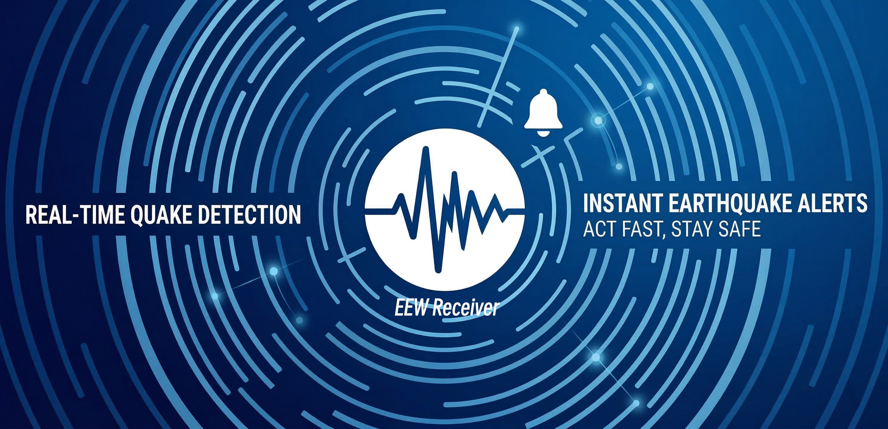
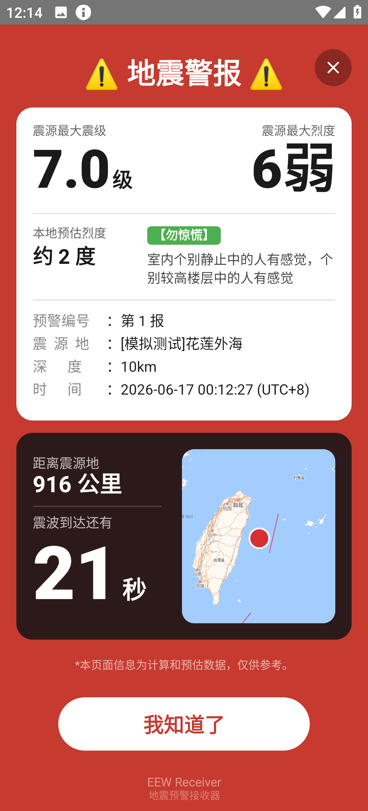
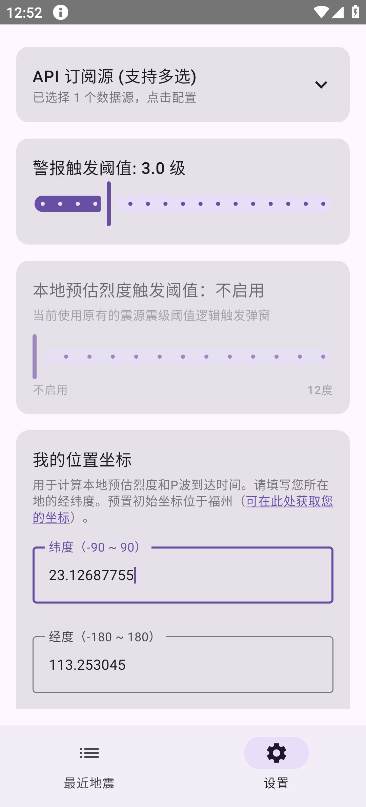
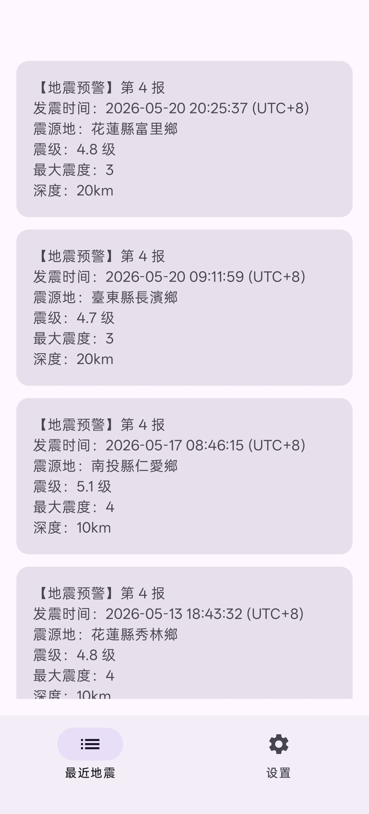

# EEW-Receiver (地震预警接收器)

[-success?style=for-the-badge&logo=android)](https://github.com/evan8686/EEW-Receiver/releases/latest)
[-C71D23?style=for-the-badge&logo=android)](https://gitee.com/evan8686/eew-receiver/releases/latest)

### 📌 项目目的
大陆的地震预警系统目前尚未接入 **台湾地区中央气象署（CWA）** 的地震预警。而作为受台湾地震影响明显的 福建/浙江 地区，经常有明显震感，却得不到任何预警。为了确保福建、浙江南部沿海城市的居民能及时收到预警，特别做了这个项目。

### 🛠️ 开发背景故事
* **痛点与导火索**： 身处福建，常受台湾地区的强震波及，但每次遭遇这种情况，手机系统自带预警与（中国地震台网/福建地震台）官方小程序总是“失声”。
  2026年12月27日晚23:05 台湾宜兰外海7.0级强震，福州因盆地效应增大震感，经历了持续数分钟的恐怖摇晃，这场地震华东华南多省都有感。然而福建的预警全程静默，直到震感过去数分钟后（23:11）才收到地震正式报。

* **痛点成因分析**： 大陆与台湾地区的地震监测网目前未实现互联，且大陆系统未有接入台湾地区中央气象署对外开放的 API 的计划。

* **预警失能逻辑**： 这导致了一个尴尬的技术时间差 —— 当台湾本岛的测站触发预警时，福建系统还在空等地震波跨海抵达平潭、泉州等沿海地震监测基站（需要约 30 秒）。等基站监测到震波并完成计算时，地震波已抵达福建大部地区。系统往往会判定数据已失去预警时效，从而直接“弃发”。反观大陆内部的地震，只要震中测站触发便直接上报全国网并及时跨省直推到可能受影响的区域，无需等待被波及省份的本地测站响应。

* **解决方案**： 为打破这种信息滞后，我决定自主开发一款轻量级手机预警 APP。通过直接接入台湾地区的地震预警数据并打通本地推送，跨过物理监测的时间差，从而在破坏性震感到来前，为福建地区争取近 1 分钟的宝贵避险时间。

---
> [!CAUTION]
> ### 🚨 重要声明：关于软件边界与漏报排查
> 
> **本应用的核心设计目的是纯粹的“防灾避险”，当影响用户所在地的地震发生时，能提供及时的预警信息。本应用并非供地震爱好者使用的“全球地震实时监控工具”。**
> 
> **虽然应用开放了多源订阅功能，但同时维持大量 WebSocket 长链接并发，极易被安卓系统底层识别为异常网络行为或恶意耗电，从而触发强制断流与杀后台。本人作为业余开发者，无义务也无精力为这种严重偏离软件设计初衷的需求提供异常排查与技术支持。**
> 
> **为了确保危急时刻预警的绝对稳定，强烈建议仅勾选与您所在地防灾最相关的唯一机构：**
> * **福建、浙江等沿海地区：建议仅开启 台湾地区中央气象署 (CWA)**
> * **四川及周边地区：建议仅开启 四川地震局**
> * **大陆其他地区：建议仅开启 中国地震台网 (CENC)**
> 
> **如果您开启软件只是为了全局监控全球各地对您所在地毫无波及的地震数据，请另寻其他专业监控工具。本 APP 并非为您的需求所设计，因强行多开导致的断线、漏报等后果请自行承担。**
> 
> **🔍 关于漏报的责任归属与排查建议：**
> **本应用不具备独立测定和下发数据的能力，预警数据完全依赖于 Wolfx 开源 API 转发。如果您在仅开启单个源，且确认 APP 后台绝对存活的情况下遭遇漏报，请在提交 Issue 前，自行使用 WebSocket 工具使用query指令查询确认 Wolfx 服务端在当时是否成功下发了该次地震报文。具体指令请参考wolfx项目官网**
> * **若 Wolfx 服务端未下发：此为上游数据源原因，APP 无法无中生有，请勿向本项目反馈。您可以联系wolfx项目咨询**
> * **若确认 Wolfx 服务端已下发，但 APP 未响应：此时才可能属于应用层面的逻辑异常。感谢理解！**

---
### 📱 应用截图

  
  
  

V2.0 版本 采用了全新设计的全屏弹窗预警界面，更加美观，信息更加实用更加丰富，新增了倒计时和语言播报，本地预估烈度和参考震感避险警示度信息，同时增加了震中距和震中位置瓦片地图显示；

设置页面新增了本地预估烈度阈值条，警报响应灵敏度设置更加灵活；您可以随时调整您的关注地作为预警坐标；

最近地震列表中将储存最近地震最新一报的数据；

---

### 🛠️ 项目性质
* **项目性质**：公益项目，免费使用。本项目使用了 **Wolfx** 的 websocket API 接口，通过手机建立websocket 长链接来订阅推送。API 说明：https://wolfx.jp/apidoc_zh ；
* **注意事项**：本人不对接口的稳定性负责。本人暂无丰富的软件开发经验，目前项目以自用为主要目的，并欢迎大家参与测试和使用；
* **核心优势**：不使用Google FCM推送，而是直接接收来自websocket API的推送。确保第一时间收到推送！（您在谷歌应用商店安装的来自其他地区的预警APP，通常使用谷歌FCM推送，在大陆网络环境可能无法正常获取推送，延时可能长达数小时甚至一整天，这对于地震预警来说将失去意义）；
---

### 📖 使用说明
1. **修改阈值**：打开 APP 进入设置，可修改全屏警报的震级阈值（此处指的是EEW推送里的震级，而非您的本地实际震级。默认为3），或是启用本地预估烈度阈值。
2. **权限授予**：确保您已经为 APP 授予了所有必要的通知权限，并在系统设置中配置防杀后台相关的权限。
3. **运行状态**：
    * **监控中**：未收到预警时，通知栏会常驻“地震预警监控中”的通知（为了防杀）。
    * **未达阈值**：收到 API 的地震预警推送时，若未达阈值，将只弹普通通知。
    * **达到阈值**：若已达阈值，则除了弹通知外，还将触发全屏警报、震动。
4. **数据源说明**：当前内建默认源为 **台湾中央气象署**。（这是福建地区迫切需要的预警信息。您可自行勾选更多源，但这将增加耗电。大陆境内发生的地震预警，仍然建议您开启手机系统自带的地震预警）
5. **强制警报**：为了不漏掉任何一次关键预警，APP 采用系统闹钟音量通道进行播报。警报音量将不受媒体音量静音或手机响铃模式影响，完全遵循您的系统闹钟音量设置，确保预警信息的第一时间送达。
---

### 🧪 功能测试流程【请务必在安装后进行测试！！！】

#### 1. 测试手机使用状态下全屏弹窗警报功能
* 点击设置页面中的 **“模拟触发”** 按钮。
* 立即返回到手机桌面。
* 等待全屏警报弹出，确认是否有全屏警报、声音和震动，并查看通知栏是否有测试预警的通知。

#### 2. 测试锁屏息屏状态下全屏弹窗警报功能
* 点击 **“模拟触发”** 按钮后，立即返回桌面并立刻按下电源键息屏（需在 3 秒内尽快完成）。
* 等待全屏警报弹出，确认是否有全屏警报、声音和震动，并查看通知栏是否有测试预警的通知。

---

### ⚠️ 关键配置【重要！！！APP需要后台保活才有意义！】
请严格按下列方式操作，以确保核心预警功能能够保活并持续工作：

#### **1. 设置 - 通知 - EEW Receiver**
* **a.** 开启“允许通知”，并将 **“锁屏/横幅”** 打勾。
* **b.** 打开 **“铃声/震动/允许打扰”**（该项指即便手机处于免打扰模式时，应用仍能正常响铃和震动）。
* **c.** 将“类别”下的 **“地震预警事件”** 设为允许通知，“地震预警后台监控”则维持默认的“静默通知”即可。

#### **2. 设置 - 应用管理 - EEW Receiver - 权限管理**
* **a.** 锁屏显示：设为 **“允许”**。
* **b.** 滚动页面到下方，进入 **“其他权限”** -> **“特殊应用权限”**：（您先进入这个页面，尝试调整权限，系统会提示您需要解锁限制）
* **c.** 回到EEW Receiver - 权限管理 主界面，此时点击右上角新出现的 3 个点，选择 **“解锁所有授权限制”** 进行解除。
* **d.** 回到**“特殊应用权限”**页面
    * **悬浮窗**：设为“允许”。
    * **后台弹出界面**：设为“允许”。
    * **发送全屏通知**：设为“允许”。

#### **3. 桌面多任务界面 - EEW Receiver - 锁定不清理**
* **a.** 上滑呼出多任务界面
* **b.** 找到 EEW Reveiver，点击 3 个点，选择 **“锁定”**  （即，在多任务窗口一键清理使用过的应用时，不会被杀掉）

#### **4. 耗电管理 - EEW Receiver - 完全允许后台行为**
* **a.** 进入耗电管理相关的设置界面
* **b.** 找到 EEW Reveiver，选择 **“完全允许后台行为”**

#### **5. 应用 - 自启动 - 允许 EEW Receiver 自启动**

#### 以上设置 以 OPPO ColorOS 16 为例，若您使用 小米澎湃OS，vivo OriginOS 等，请自行参考并在系统设置中操作相关选项
#### 部分选项名称和入口在不同OS上可能略有差异，但基本类似。

---

## 🙏 特别鸣谢

本项目的数据源与灵感离不开以下开源项目与无私服务的支持：

* **[Wolfx Project](https://wolfx.jp/)**：为本项目提供了稳定、快速且无私的地震预警 WebSocket API 转发服务。
* **[kanameishi 要石](https://github.com/Lipomoea/kanameishi)**：为本项目的开发与数据源接入提供了优秀的参考与灵感。（要石 是一个电脑版的地震预警软件，非常推荐在电脑端安装）

---

## ⚠️ 免责声明

1. **个人业余项目**：本项目为个人出于兴趣和防灾需求开发的非商业化测试软件。本人非专业安卓开发工程师，软件开发经验有限。应用在实际运行中可能存在 Bug 等问题，仅供**日常辅助参考与测试使用**，如有不完善之处请多海涵。
2. **第三方服务稳定性**：本应用的数据强依赖于 [Wolfx Project] 提供的第三方 API 接口。对于因网络波动、您的本地网络环境、第三方接口异常等原因导致的预警延迟、断线或接收失败，开发者无法控制，亦无法提供任何全天候的稳定性保证。
3. **预警准确性局限**：地震预警（EEW）是一项极其复杂的科学与工程系统。本应用展示的所有预警信息，均直接客观地转发自各地震监测发布机构（如中国地震台网、台湾地区中央气象署等）的原始测定报文。受限于现代地震台网的观测密度与科学算法的物理极限，**预警信息不可避免地会存在误差、误报、漏报或与最终测定结果不符的情况。**
4. **软件后台运行稳定性**：尽管开发过程以尽量确保软件能在手机后台保活，并做出配置说明。由于各品牌手机OS处理应用后台进程的逻辑不同，因此无法保证在所有手机上都能持久后台保活。如遇到应用无法保活问题，请务必检查是否依照配置说明正确设置，或与您的手机品牌方联系了解或反馈应用后台保活问题。
4. **免责条款**：请务必**不要**将本应用作为您生命和财产安全的唯一依赖手段。在收到预警警报时，请结合您身边的实际震感与环境迅速做出合理的避险判断。**对于使用或无法使用本软件而导致的任何直接或间接损失（包括但不限于人身伤害、财产损失、恐慌等），开发者不承担任何形式的法律与经济责任。** 使用本软件即代表您已知晓并同意本免责声明的全部内容。的全部内容。
